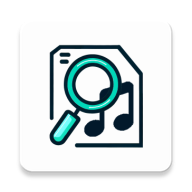

<h3 align="right"><a href="README.md">中文</a> / English</h3>

    
    <h2 align="center"> Welcome to the Get ID3 Tag Tool APP</h2>
    <h3 align="center">This tool is mainly used in conjunction with the <a href="https://github.com/Winnie0408/SaltPlayerConverter">SaltPlayer Playlist Converter</a>, but it can also be used independently.</h3>

---

## How to Use

1. Open the **Get ID3 Tag** application.
2. Click the **Select Directory** button.
3. Grant permissions as prompted by the software:
    * Android 11 and above: Grant **Manage All Files Access Permission** `android.permission.MANAGE_EXTERNAL_STORAGE`
    * Android 10 and below: Grant **Read/Write External Storage Permissions** `android.permission.READ_EXTERNAL_STORAGE`与`android.permission.WRITE_EXTERNAL_STORAGE`
4. Follow the software prompts to select the directory where your music files are stored on your device. The selection method is shown in the figure below: 
   **Note the current parent directory displayed in the first line of the picture**

| Type of Music File Storage | In the Same Directory                        |
|----------------------------|----------------------------------------------|
| Directory Tree Example     |        | 
| Operation Method           | Directly select the parent directory `Music` | 

| Type of Music File Storage | In Subdirectories of the Same Directory      | 
|----------------------------|----------------------------------------------|
| Directory Tree Example     |        |
| Operation Method           | Directly select the parent directory `Music` |

| Type of Music File Storage | In Different Directories                                                                                                                                                                             |
|----------------------------|------------------------------------------------------------------------------------------------------------------------------------------------------------------------------------------------------|
| Directory Tree Example     |                                                                                                                                                                |
| Operation Method           | Multiple selection operations are required, **each time select one** directory that stores music (such as `中文歌曲`, `temp` in the picture), and choose **Append** in the following conflict dialog box |

5. Wait for the music ID3 information to be exported.
6. Go to the `/storage/emulated/0/Download`(i.e., `/sdcard/Download`)directory and check the **Local Music Export.txt** file.
7. Use the **Local Music Export.txt** file.

## Supported Music Formats

- OGG
- MP3
- FLAC
- MP4
- M4A
- M4P
- WMA
- WAV
- RA
- RM
- M4B
- AIF
- AIFF
- AIFC
- DSF
- DFF

## Description of Permissions Required

- Android 11 (API 30) and above：
    - **Manage All Files Access Permission** (`android.permission.MANAGE_EXTERNAL_STORAGE`): Read music files from external storage (`/storage/emulated/0`) and its subdirectories, write result files.
- Android 10 (API 29) and below：
    - **Read External Storage Permissions** (`android.permission.READ_EXTERNAL_STORAGE`): Reading music files from external storage (`/storage/emulated/0`) and its subdirectories.
    - **Write External Storage Permissions** (`android.permission.WRITE_EXTERNAL_STORAGE`): Write the result file to the download directory (`/storage/emulated/0/Download`).

## Sponsorship & Support

You can give me a ⭐ or buy me a cup of coffee if my project is helpful to you! 
Thank you very much for your support! 
